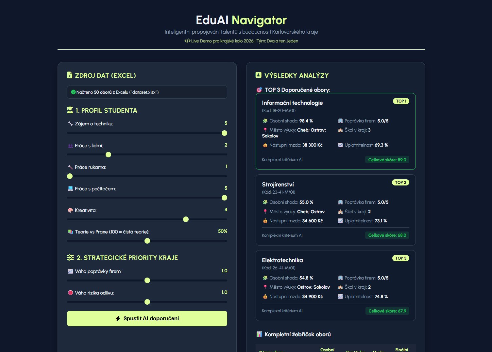

# 🎓 EduAI Navigator



> 🏆 **1st Place Winner – Regional Round of the AI Olympiad 2026 (Karlovy Vary Region)**
> 🌐 **[👉 Try Live Demo](https://znamirovsky.github.io/eduai-navigator/)**
> **Team:** Dva a ten Jeden  
> **Development Time Limit:** 4 hours  
> **Development Methodology:** Vibe coding with **Gemini 3.5**

---

## 📌 About the Project

**EduAI Navigator** is an intelligent recommendation platform designed to connect student talent with the future economic and labor needs of the **Karlovy Vary Region**.

The application solves the challenge of inefficient secondary school selection by considering student preferences alongside regional strategic priorities, such as local industry demand and the risk of brain drain.

---

## 📊 Dataset Specifications

> ℹ️ **Data Source:** The dataset (`dataset.xlsx`) was provided as part of the official assignment for the Regional Round of the AI Olympiad 2026 and was processed/structured by our team for the purpose of this application.

The recommendation engine runs on a real dataset of **50 secondary school fields** (`dataset.xlsx`) taught across the Karlovy Vary Region.

### Dataset Attributes & Schema
* **Identification:** `obor_id`, `nazev_oboru`, `kod_oboru`
* **Student Skill Profiles (1–5 scale):** `zajem_technika`, `zajem_lide`, `prace_rukama`, `prace_s_pocitacem`, `kreativita`
* **Education Balance:** `teorie_vs_praxe` (percentage ratio of theory vs. practice)
* **Regional Market Indicators:** `poptavka_v_kraji_1_5`, `uplatnitelnost_v_kraji_procent`, `riziko_odlivu_1_5`
* **Capacity & Statistics:** `pocet_skol_v_kraji`, `vyucuje_se_v`, `nastupni_mzda_kc`, `absolventi_kraj_2024`, `nove_prijati_kraj`

---

## ⚡ Key Features

* **6D Student Profiling:** Dynamic sliders for interest in tech, working with people, manual crafts, computers, creativity, and theoretical vs. practical focus.
* **Regional Priority Adjustments:** Custom weighting sliders to prioritize local employer demand and mitigate brain drain risks.
* **Vector Match Algorithm:** Calculates 6D Euclidean distance between the user profile and all 50 dataset entries.
* **Client-Side Excel Parser:** Direct integration with `xlsx.js` to process `dataset.xlsx` instantly in the browser without server overhead.
* **Interactive Results Dashboard:** Displays **TOP 3 recommended fields** with detailed metrics (starting salary, employment rate, study locations) alongside a full ranking table.

---

## 🛠️ Tech Stack

* **Frontend:** HTML5, CSS3 (Custom Dark Theme, Flexbox, Grid Layout), Vanilla JavaScript (ES6+).
* **Libraries:** 
  * [SheetJS (xlsx.js)](https://sheetjs.com/) – In-browser Excel parsing.
  * [FontAwesome 6.5.1](https://fontawesome.com/) – Interface iconography.
  * Google Fonts (Urbanist).
* **AI Tooling:** Gemini (Vibe coding, UI structure, mathematical model formulation).

---

## 🚀 How to Run Locally

Because the application fetches `dataset.xlsx` via the browser's `fetch()` API, it must be hosted on a local web server to comply with CORS security policies.

1. **Clone the repository:**
   ```bash
   git clone https://github.com/znamirovsky/eduai-navigator.git
   cd eduai-navigator
   ```

2. **Ensure File Placement:**
Make sure `index.html` and `dataset.xlsx` are in the same directory.

3. **Start a Local Server:**
   * **VS Code:** Install the **Live Server** extension, right-click `index.html` -> **Open with Live Server**.
   * **Python:** Run the following command in your project terminal:
     `python -m http.server 8000`
     
     Open `http://localhost:8000` in your web browser.

---

## 🧠 Algorithmic Model

1. **Normalization:** Input parameters are scaled to a unified range (1–5).
2. **Personal Compatibility Score:** Computes Euclidean distance in 6D vector space:  
   $$Dist = \sqrt{(Tech_u - Tech_o)^2 + (Lide_u - Lide_o)^2 + (Ruka_u - Ruka_o)^2 + (PC_u - PC_o)^2 + (Krea_u - Krea_o)^2 + (Teorie_u - Teorie_o)^2}$$
3. **Comprehensive Regional Score:** Combines personal fit (60%) with regional market demand (20% * w_demand) and inverted brain-drain risk (20% * w_drain).

---

## 👥 Team & Authors

Developed by team **Dva a ten Jeden** during the AI Olympiad 2026:

* **[Aaron Znamirovský](https://github.com/znamirovsky)** – Lead Developer, Architecture & Integration
* **Jan Šimurda** – AI Ethics & Impact Analysis
* **[Tomáš Stehlík](https://github.com/TomioStehlik)** – Presentation & Pitch Strategy